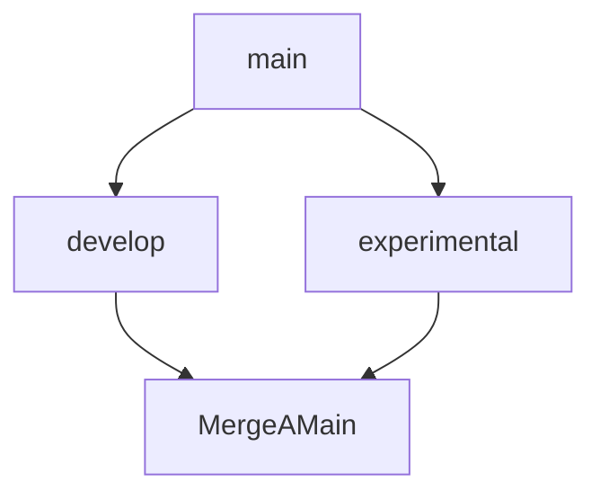

# Sitio Web para el curso de platzi de html y css3
**Bienvenido** al repositorio de mi pagina web de lista de compras para el curso de HTML y CSS3  de platzi 👨‍💻

## Este repo tiene varias secciones

   # Lista
 Esta seccion esta dividida en 3

 1. ## Base

 En esta seccion tenemos El index.html
 
 2. ## CSS

 Aca se encuentra styles.css donde encontramos los estilos de el sitio web

 3.  ## Pics
 Aca se encuentran las imagenes de el repo

# Ramas

